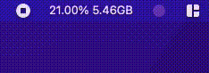

# MAI

MAI (Mac Activity Indicator) is a menu bar application to show activity stats like CPU and RAM usage.

## Requirements

The only requirements for this project are `Rust` and `Cargo`.  
Both can be installed with `Rustup`: https://www.rust-lang.org/learn/get-started

## Commands

- `cargo run` - Runs the app
- `cargo test` - Runs all tests
- `cargo build` - Builds app in `target/debug`
- `cargo build --release` - Builds app in `target/release`

## Building and Installing `MAI.app` Bundle

To build the `MAI.app` bundle, navigate to the project directory in your terminal and run `./bundle-release.sh`.  

This will create the `MAI.app` bundle in `target/release/bundle`.  

To install it, move `MAI.app` to your `Applications` folder in your Mac.
